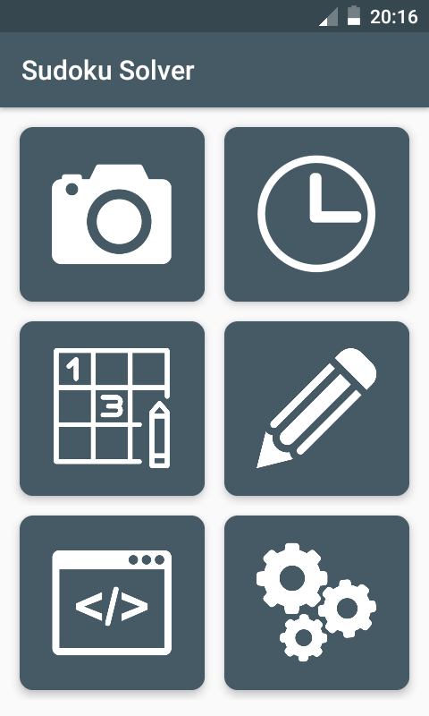

# Sudoku Solver

>It is an application to solve sudoku grid.

	
	

## Credits

This application uses:

- **OpenCV** for computer vision, and
- **Tess-two** for characters recognition.

In addition, it implements a portrait camera code from ***Jocstech*** github repository at [PortraitCameraView.java](https://github.com/jocstech/AndroidCameraSudokuSolver/blob/master/SudokuSolver/app/src/main/java/com/example/calvin/sudokusolver/PortraitCameraView.java).

For design:

- **Android Support Library**
- **Google Material Design Icons**

## About

Sudoku Solver is an application for solving sudoku grid directly from android camera.

This application run on all android device, but design is better on android **Lollipop** and higher.

## Author

I'm  **Rivo Link**, you can find me on these link:

- [Github](https://github.com/RivoLink)
- [LinkedIn](https://www.linkedin.com/in/rivo-link/)
- [Facebook](https://www.facebook.com/rivo.link3)
